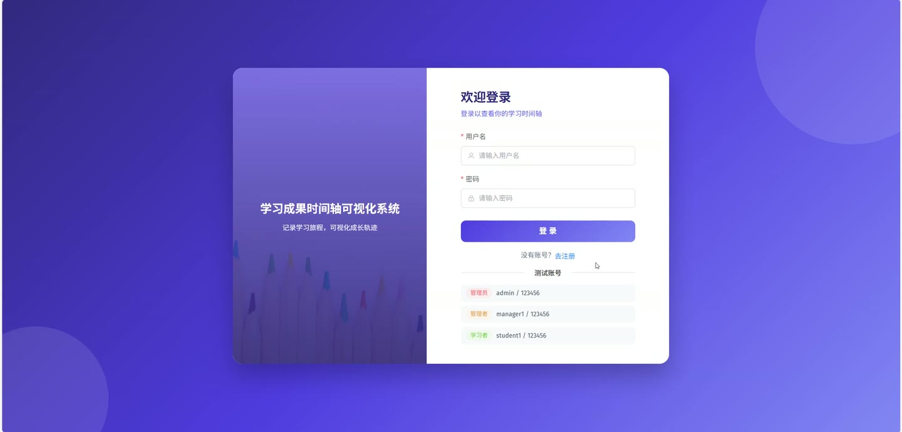
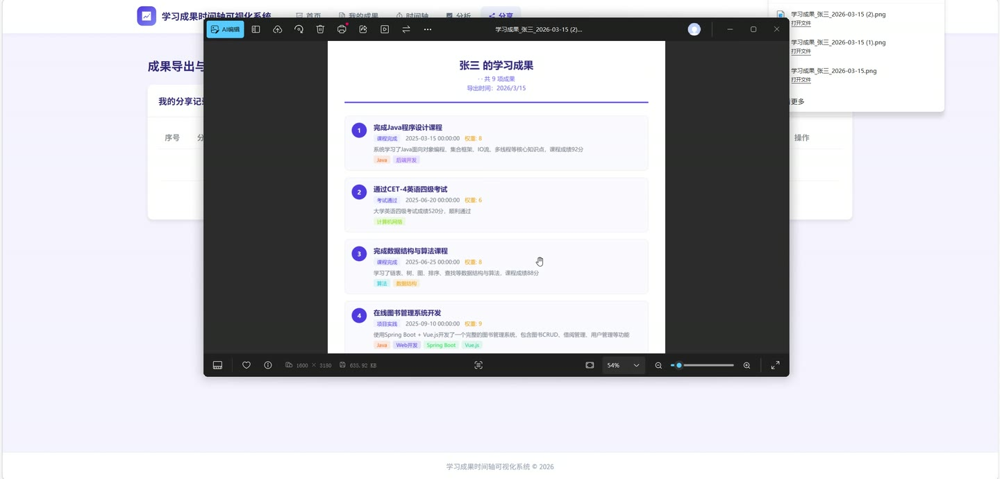
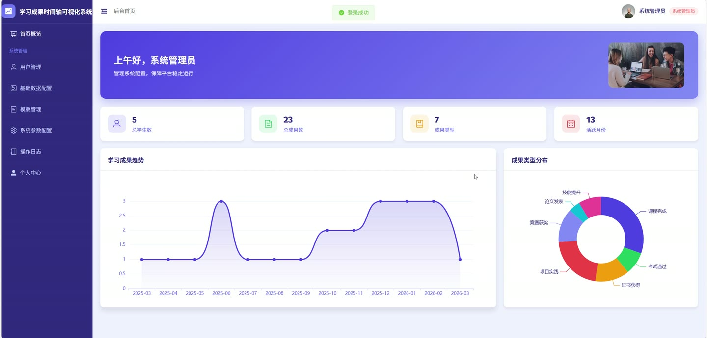
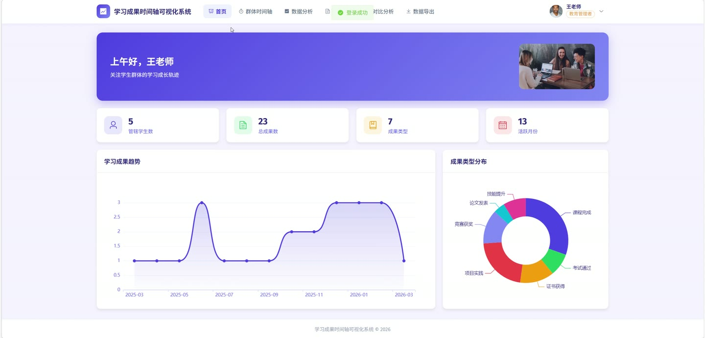
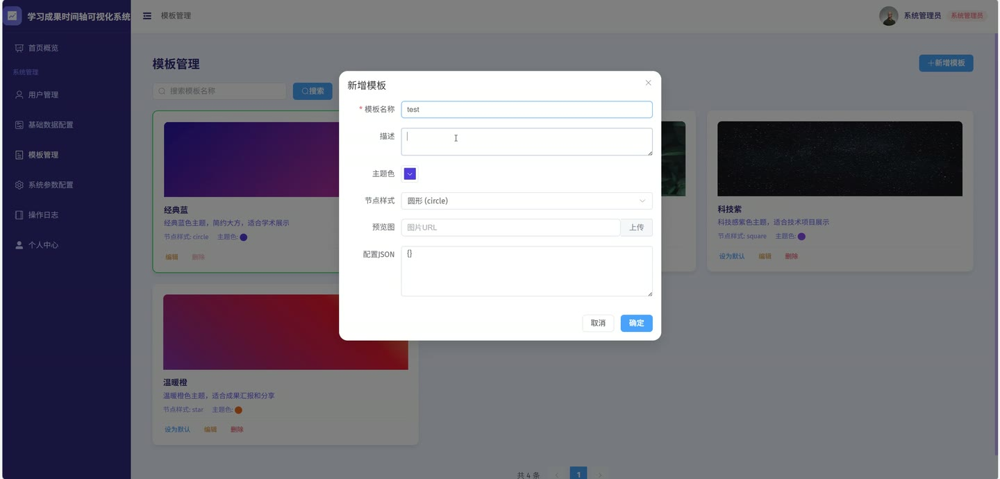
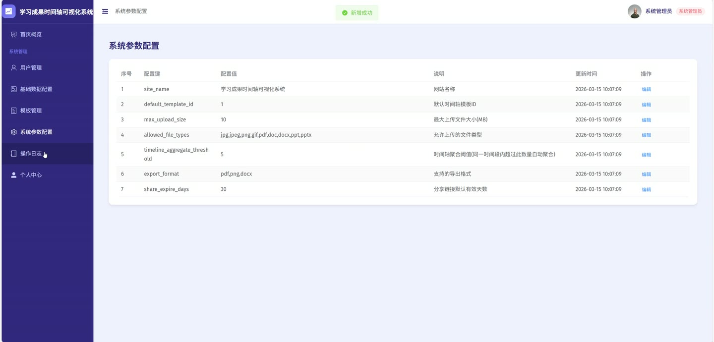

# (附文档)Springboot3+Vue3+MySQL 学习成果时间轴可视化系统

**技术栈**：Springboot3、Vue3、MySQL

### 系统简介

本系统是一个基于 Spring Boot 3 + Vue 3 + MySQL 的浏览器端学习成果时间轴可视化平台。系统采用前后端分离架构，支持学习者（LEARNER）、管理员（ADMIN）两种角色。学习者可以记录、管理自己的学习成果并以时间轴形式直观展示，管理员负责用户管理、系统配置、操作日志审计等后台维护工作。
 
### 核心功能
 
### 普通用户端

 
- 注册账号（填写用户名、密码、真实姓名、手机号、邮箱、班级、专业等信息） 
- 登录系统（通过用户名和密码登录，返回 JWT Token） 
- 查看个人信息（获取当前登录用户的基本信息、角色、班级、专业等） 
- 修改个人信息（更新真实姓名、手机号、邮箱、头像等字段） 
- 修改登录密码（输入旧密码和新密码完成密码变更） 
- 新增学习成果（填写标题、描述、分类、完成时间、权重、资源链接、封面图，并关联标签和能力指标） 
- 编辑学习成果（修改已有成果的标题、描述、分类、时间、权重、关联标签和能力指标） 
- 删除学习成果（删除指定成果及其关联的标签关系、能力关系、附件和注释） 
- 查看成果详情（展示成果的标题、描述、分类名称、完成时间、权重、标签列表、附件列表、注释列表、关联能力指标） 
- 分页查询成果列表（支持按分类、关键词、时间范围、标签筛选，自动限制为当前用户的成果） 
- 查看个人时间轴（按完成时间升序排列成果，支持按分类、标签、时间范围筛选） 
- 查看个人统计（总成果数、按分类统计数量、按月统计数量、按能力指标统计数量、平均权重） 
- 添加成果注释（对指定成果添加文字注释，记录创建时间和作者真实姓名） 
- 编辑/删除自己的注释（修改注释内容或删除指定注释） 
- 上传成果附件（上传文件并关联到指定成果，记录文件名、路径、类型、大小） 
- 删除附件（删除指定附件记录及物理文件） 
- 创建分享链接（生成唯一分享码，设置标题和分享类型，支持设置过期天数） 
- 查看分享页面（通过分享码查看分享者的学习成果时间轴） 
- 管理自己的分享记录（分页查看分享列表，支持删除分享） 
- 查看所有标签列表（获取系统中已启用的标签） 
- 查看所有分类列表（获取已启用的分类及其排序） 
- 查看能力指标树（获取树形结构的能力指标列表）
 
### 管理员端

 
- 用户管理：分页查询用户列表（支持按关键词、角色、班级、状态筛选） 
- 用户管理：查看用户详情（获取指定用户的全部信息） 
- 用户管理：新增用户（手动添加新用户账号） 
- 用户管理：编辑用户信息（修改任意用户的真实姓名、手机号、邮箱、角色、班级、专业等） 
- 用户管理：修改用户状态（启用或禁用指定用户账号） 
- 用户管理：删除用户（移除指定用户账号） 
- 成果管理：查看所有用户的学习成果列表（支持按用户、分类、关键词、时间范围、标签筛选） 
- 成果管理：查看任意成果的详细内容 
- 成果管理：删除违规或过期的学习成果 
- 分类管理：新增/编辑/删除成果分类（设置名称、描述、图标、排序、启用状态） 
- 标签管理：新增/编辑/删除成果标签（设置标签名称和颜色） 
- 能力指标管理：新增/编辑/删除能力指标（支持树形结构，设置名称、描述、父级、排序） 
- 时间轴模板管理：新增/编辑/删除时间轴模板（设置名称、描述、配置JSON、主题色、节点样式、预览图） 
- 时间轴模板管理：设置默认模板（将指定模板设为系统默认） 
- 系统配置管理：查看所有系统配置项（键值对形式） 
- 系统配置管理：修改系统配置（如最大上传大小、允许文件类型、分享过期天数等） 
- 操作日志管理：分页查询操作日志（支持按操作关键词、用户名、时间范围筛选） 
- 操作日志管理：清理日志（删除指定时间之前的操作日志） 
- 分享管理：查看所有用户的分享记录（分页列表） 
- 分享管理：删除违规分享链接 
- 群组时间轴：按班级或专业查看多个学习者的合并时间轴 
- 群组统计：按班级或专业统计总学生数、总成果数、分类分布、月度趋势、能力指标分布 
- 用户对比：选择多个用户进行成果数量、分类、时间等多维度对比 
- 班级对比：选择多个班级进行成果数量、分类等对比分析 
- 获取班级列表（获取系统中所有不重复的班级名称） 
- 获取专业列表（获取系统中所有不重复的专业名称）
 
### 技术栈

 后端框架Spring Boot 3.x ORMMyBatis-Plus 权限认证JWT Token（基于请求属性传递用户信息） 前端框架Vue 3 状态管理Vuex / Pinia（由代码中 router 和 store 目录推断） 构建工具Vite（由项目结构推断） 数据库MySQL
 
### 交付内容

 
- 后端完整源码 
- 前端完整源码 
- 数据库初始化脚本 
- 万字文档

## 界面展示

---

## 获取完整源码 + 万字文档

本仓库为项目介绍页。**完整前后端源码、数据库初始化脚本、万字项目文档**，请加微信 `kangkangcode`，或访问 [codekk.top](http://codekk.top) 获取。

可作课程设计 / 毕业设计参考，支持远程部署调试。